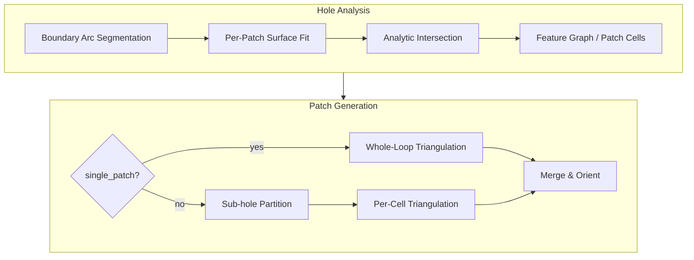

# Feature-Preserving CAD Hole Filling via Analytic Surface Recognition and Constrained Patch Triangulation

---

## Overview

**Research problem.** Triangle meshes exported from CAD or scan-to-CAD pipelines frequently contain *boundary holes*—closed loops of open boundary edges where faces are missing. Filling such holes while preserving the underlying analytic structure (planes, cylinders, cones, spheres) and sharp feature lines is a fundamental step in CAD model repair, reverse engineering, and mesh conditioning.

**Motivation.** Classical hole-filling methods—Delaunay triangulation, Poisson reconstruction, or Laplacian smoothing—produce watertight meshes but often blur sharp edges, ignore multi-surface junctions, and fail to respect the parametric geometry implied by neighboring CAD faces. For mechanical parts, the filled patch should align with recovered analytic surfaces and intersecting feature curves rather than approximate them as free-form geometry.

**Challenges.**

- Hole boundaries may span multiple analytic patches separated by sharp edges or triple-surface junctions.
- Intersection curves between recovered surfaces must be clipped, ordered, and stitched into sub-hole boundaries.
- Interior triangulation must respect parameter domains, feature constraints, and surface lift-back while maintaining mesh quality.
- Tessellation noise near hole rims (tooth faces) can destabilize boundary extraction and surface fitting.

**Main contributions.**

1. A **half-edge-based hole detection** pipeline that enumerates all boundary loops on triangle meshes.
2. **Robust analytic surface recognition** (plane, cylinder, cone, sphere) with confidence scoring and transition-surface fallback for local patches adjacent to each hole.
3. **Feature recovery and patch-cell assembly** that recovers bounded intersection curves, virtual bridges, and optional junctions, then decomposes complex holes into fillable sub-patches (topology `template_hint` is diagnostic only).
4. **Constrained patch triangulation** in 2D parameter domains with adaptive boundary sampling, Delaunay filtering, local optimization, and analytic surface lift-back.
5. An end-to-end CLI and batch evaluation harness with debug visualization for research reproducibility.

---

## Pipeline

The system processes a watertight-or-near-watertight triangle mesh with one or more boundary holes and produces a repaired mesh with analytically guided fill patches.

```mermaid
flowchart LR
    A[Input Triangle Mesh<br/>OBJ / STL / PLY]
    B[Half-Edge Construction<br/>& Hole Detection]
    C[Boundary Cleaning<br/>Optional]
    D[Local Patch Clustering<br/>& Surface Fitting]
    E[Feature Recovery<br/>Intersection Curves]
    F[Hole Decomposition<br/>Sub-hole Preparation]
    G[Parametric Domain<br/>Construction]
    H[Constrained Patch<br/>Triangulation]
    I[Mesh Stitching<br/>& Orientation Fix]
    J[Output Repaired Mesh]

    A --> B --> C --> D --> E --> F --> G --> H --> I --> J
```



| Stage | Description | Module |
|-------|-------------|--------|
| 1 | Build half-edge mesh; enumerate all boundary loops as candidate holes | [`libs/hole_detector.py`](libs/hole_detector.py) |
| 2 | Iteratively remove tooth faces (≥2 boundary edges) to smooth the hole rim | [`libs/hole_boundary_clean.py`](libs/hole_boundary_clean.py) |
| 3 | Cluster hole-adjacent faces; fit analytic surfaces per patch | [`libs/surface_fitting.py`](libs/surface_fitting.py) |
| 4 | Recover intersection curves, junction points, and feature graph | [`libs/surface_intersections.py`](libs/surface_intersections.py), [`libs/feature_graph.py`](libs/feature_graph.py) |
| 5 | Classify hole topology; generate `PreparedSubhole` boundaries with UV parameterization | [`libs/hole_analyzer.py`](libs/hole_analyzer.py) |
| 6 | Triangulate each sub-hole in parameter space; lift vertices to 3D surfaces | [`libs/hole_patch_triangulation.py`](libs/hole_patch_triangulation.py), [`libs/surface_parameterization.py`](libs/surface_parameterization.py) |
| 7 | Merge patches, fix face orientation, export OBJ/PLY | [`run_cad_fill.py`](run_cad_fill.py) |

Hole types exposed to the fill stage are **`single_patch`** (one analytic domain) and **`multi_patch`** (partitioned sub-holes). Detailed topology templates (`sharp_edge_crossing`, `triple_surface_junction`, etc.) are recorded as `template_hint` for analysis and ablation.



---

## Method

### Surface Recognition

Local face patches adjacent to the hole boundary are clustered by connectivity and normal coherence. For each patch, the fitter evaluates candidate analytic models and selects the best-scoring surface:

| Surface Type | Fitting Method | Notes |
|--------------|----------------|-------|
| **Plane** | Least-squares normal & offset from support vertices | Baseline for flat CAD faces |
| **Cylinder** | Kåsa circle fit in normal plane + axis extraction | Robust axisymmetric fitting |
| **Cone** | Axisymmetric shape fitting with apex estimation | Paired with plane/cylinder intersections |
| **Sphere** | Algebraic sphere least-squares | Used at spherical caps and fillets |
| **Transition surface** | Fallback when analytic residual exceeds threshold | Marks fillet/blend regions |
| **Freeform fallback** | Local plane proxy | Used when no analytic model is accepted |

Each fit returns `fit_score`, `fit_residual`, and a discrete **`fit_confidence`** (`high` / `medium` / `low`). NURBS fitting is not performed directly; freeform regions are handled via transition-surface parameterization and local planar projection.

Implementation: [`libs/surface_fitting.py`](libs/surface_fitting.py) — `fit_patch_surface()`, `fit_patch_surfaces()`.

### Feature Recovery

Given per-patch analytic fits, the system reconstructs the feature structure of the hole:

- **Sharp edge detection.** Feature points are identified where adjacent interior face normals exhibit significant dihedral angles along the hole boundary.
- **Feature curve fitting.** Pairwise analytic intersections yield bounded curve segments: lines (`plane–plane`), circle arcs (`sphere–plane`, `cylinder–plane`), and higher-order analytic curves (`cone–plane`, `cylinder–cylinder`, `cone–cylinder`, `cone–sphere`).
- **Surface intersection extraction.** [`analytic_intersection()`](libs/surface_intersections.py) computes infinite analytic curves; [`recover_bounded_intersection_curves()`](libs/surface_intersections.py) clips them to the hole neighborhood and assigns endpoint vertex indices.
- **Curve continuity.** Intersection endpoints are refined via [`intersection_corner_refinement.py`](libs/intersection_corner_refinement.py); triple junctions are estimated by [`estimate_triple_junction()`](libs/surface_intersections.py).

The recovered structure is encoded in a **feature graph** ([`libs/feature_graph.py`](libs/feature_graph.py)): feature points, bounded analytic segments, patch cells, and a global confidence score.

### Hole Decomposition

Complex holes are decomposed before triangulation:

- **Hole classification.** Public types: `single_patch` vs. `multi_patch`. Internal templates include `sharp_edge_crossing`, `triple_surface_junction`, `closed_pair_curve_multi_patch`, and `s2c_multi_corner_pair`.
- **Sub-hole generation.** Multi-patch holes are assembled in a fixed order: closed-pair (all curve endpoints on the boundary loop) → arrangement cells (branch edges, virtual bridges/connectors, optional center cell) → two-patch sharp-edge fallback. Each `PreparedSubhole` carries ordered boundary vertices, open/closed edge chains, 2D UV coordinates, and closure kind.
- **Patch cell validation.** Recovered intersection curves and prepared sub-holes are summarized in a lightweight feature graph ([`libs/feature_graph.py`](libs/feature_graph.py)); degenerate cells are filtered via [`validate_patch_cell()`](libs/feature_graph.py). Topology templates (`template_hint`) are recorded for debugging and ablation only—they do not drive fill decisions.

Multi-patch fill failure triggers a **fallback** to whole-loop triangulation on the original boundary ring.

### Surface Reconstruction

Patch interiors are reconstructed through constrained triangulation rather than global implicit fitting:

- **Analytical surface fitting.** Boundary vertices are projected onto fitted analytic surfaces before and after triangulation.
- **Parametric surface fitting.** Each sub-hole receives a 2D parameterization ([`parameterize_boundary()`](libs/surface_parameterization.py)): planar frames for planes, cylindrical \((\theta, z)\), spherical, and conical coordinates.
- **NURBS fitting.** Not implemented; output is a triangle mesh conforming to analytic geometry.
- **Energy optimization.** Interior point placement uses constrained Delaunay triangulation (SciPy when available), followed by edge-flip and Laplacian smoothing in the parameter domain. Vertices are lifted back via `lift_parameter_point()`.

Core routine: `generate_hole_patch_mesh()` in [`libs/hole_patch_triangulation.py`](libs/hole_patch_triangulation.py).

---

## Repository Structure

```text
CAD_Hole_Fill/
├── run_cad_fill.py              # Main CLI: detect → analyze → fill → export
├── batch_run_cad_fill.py        # Batch processing with JSON summary
├── test.py                      # Quick hole detection + analysis probe
├── data/                        # Small example meshes for interactive testing
├── hole_data/                   # Benchmark cases (fandisk, ABC-derived CAD holes)
│   ├── fandisk/                 # 20-case FanDisk benchmark with metadata
│   └── hole_cases_cad*/         # Per-model synthetic hole datasets
├── out/                         # Default single-run outputs
├── out_fill/                    # Batch run outputs and summaries
└── libs/
    ├── hole_detector.py         # Half-edge mesh & boundary loop enumeration
    ├── hole_boundary_clean.py   # Tooth-face removal at hole rim
    ├── hole_analyzer.py         # Patch clustering, feature graph, sub-hole prep
    ├── surface_fitting.py       # Analytic surface fitting (plane–cone–sphere)
    ├── surface_intersections.py # Analytic intersection & bounded curve recovery
    ├── surface_parameterization.py  # 2D parameter domains & 3D lift-back
    ├── feature_graph.py         # Patch cells, feature points, confidence
    ├── intersection_corner_refinement.py  # Sharp corner endpoint refinement
    └── hole_patch_triangulation.py   # Constrained patch mesh generation
```

| Directory | Purpose |
|-----------|---------|
| `data/` | Lightweight OBJ examples (`hole_1.obj`, `cad_hole_triple.obj`, …) for quick validation |
| `hole_data/` | Research benchmark: 344 hole cases across 16 CAD models |
| `out/`, `out_fill/` | Generated repaired meshes (OBJ/PLY) and batch JSON summaries |
| `libs/` | Core geometry processing algorithms |

---

## Installation

**Requirements**

| Component | Version |
|-----------|---------|
| Python | 3.10+ (recommended) |
| NumPy | ≥ 1.20 |
| trimesh | ≥ 3.9 |
| SciPy | optional; enables Delaunay triangulation in patch generation |

CUDA is **not required**; all algorithms run on CPU.

```bash
git clone <repo-url>
cd CAD_Hole_Fill

pip install numpy trimesh scipy
```

---

## Dataset

| Dataset | Source | Scale | Format | Usage |
|---------|--------|-------|--------|-------|
| **FanDisk benchmark** | Derived from Princeton FanDisk mesh; synthetic holes cut at feature intersections | 20 cases (`case_0000`–`case_0019`) | OBJ + optional `.meta.json` | Primary topology diversity benchmark (single-patch, sharp-edge, triple-junction) |
| **ABC-derived hole cases** | Mechanical CAD models from [ABC Dataset](https://deep-geometry.github.io/abc-dataset/) | 324 cases across 15 models (`hole_cases_cad*`) | OBJ | Large-scale batch evaluation |
| **Quick examples** | Bundled test meshes | ~30 files | OBJ | Interactive CLI testing in `data/` |
| **Proprietary / custom** | User-provided CAD exports | — | OBJ / STL / PLY | Supported via CLI |

Each FanDisk case includes metadata describing the ground-truth hole topology (e.g., surface types at the boundary, junction presence).

---

## Usage

### Single hole fill

```bash
# Fill the first detected hole (default); output to out/<name>_cad_fill.obj
python run_cad_fill.py data/hole_1.obj

# Specify output path
python run_cad_fill.py data/hole_10.obj -o out/my_fill.obj

# Select the k-th hole when multiple loops exist
python run_cad_fill.py data/hole_triple.obj --loop 0

# Smooth boundary before filling (recommended for tessellated CAD exports)
python run_cad_fill.py hole_data/fandisk/case_0019.obj --hole-clean

# Color the fill patch (exports PLY by default)
python run_cad_fill.py data/hole_1.obj --color-patch

# Export fitted surfaces and intersection curves for inspection (PLY + GLB)
python run_cad_fill.py data/hole_s2c.obj --debug-analysis
```

**CLI options** (`python run_cad_fill.py -h`):

| Flag | Description |
|------|-------------|
| `-o, --output` | Output path (default: `out/<stem>_cad_fill.obj`) |
| `--loop` | Index of boundary loop to fill (default: 0) |
| `--hole-clean` | Remove tooth faces at the hole boundary |
| `--color-patch` | Color newly inserted faces |
| `--patch-color` | RGBA color string, e.g. `255,215,0,255` |
| `--debug-analysis` | Write analysis visualization (surfaces, curves) |
| `--no-orient-fix` | Disable patch normal orientation correction |

### Batch evaluation

```bash
python batch_run_cad_fill.py \
    --input-dir hole_data/fandisk \
    --output-dir out_fill/filled_fandisk \
    --summary out_fill/filled_fandisk/cad_fill_summary.json \
    --hole-clean --color
```

### Analysis-only probe

```bash
python test.py data/hole_triple.obj
# Prints hole_type, template_hint, analysis_confidence, patch fits
```

---

## Experimental Results

### FanDisk benchmark (20 cases, `--hole-clean`)

Batch summary: [`out_fill/filled_fandisk/cad_fill_summary.json`](out_fill/filled_fandisk/cad_fill_summary.json)

| Metric | Value |
|--------|-------|
| Total cases | 20 |
| Fill success rate | **90%** (18 / 20) |
| Single-patch holes | 5 |
| Sharp-edge crossing | 11 |
| Triple-surface junction | 4 |
| Failed cases | `case_0017`, `case_0019` (sharp-edge endpoint topology mismatch) |
| Mean boundary loop length | 29.4 vertices |
| Mean intersection curves (multi-patch) | 1.8 per case |

### Geometric error metrics (ground-truth evaluation)

The current release focuses on **topology-aware fill completion**. Quantitative distance metrics against ground-truth B-Rep or dense reference meshes are planned:

| Metric | Status |
|--------|--------|
| MSE / RMSE (surface distance) | Planned — requires GT mesh per case |
| Hausdorff Distance | Planned |
| Chamfer Distance | Planned |
| Normal Consistency | Planned |
| G0 / G1 Continuity at feature lines | Qualitative via `--debug-analysis` |

Surface fit residuals from the FanDisk benchmark (representative):

| Case | Topology | Dominant surfaces | Fit residual (best patch) |
|------|----------|-------------------|---------------------------|
| `case_0001` | single_patch | plane | 0.0 |
| `case_0002` | sharp_edge_crossing | cylinder + plane | 8.2×10⁻⁴ |
| `case_0004` | triple_surface_junction | 3× cylinder + plane | 4.2×10⁻⁵ |
| `case_0005` | triple_surface_junction | sphere + cone + cylinder + plane | 3.1×10⁻⁵ |

---

## Visual Results

Generate figures via `--debug-analysis` or inspect batch outputs in `out_fill/`.

**Input model with boundary hole**


*Example: `data/hole_s2c.obj` — sphere–cone–cylinder junction hole.*

**Recovered analytic surfaces and intersection curves**


*Debug export: fitted patches (plane/cylinder/cone/sphere) and intersection polylines. Use `--debug-analysis` to produce `*_analysis_scene.glb`.*

**Hole filling result**


*Repaired mesh with colored fill patch (`--color-patch`). See `out_fill/filled_fandisk/case_0004_cad_fill.ply`.*

> **Note:** Place publication-ready renders in `figures/`. The CLI produces interactive GLB/PLY debug scenes under `out/` without additional dependencies.

---

## Comparison

Qualitative comparison with representative hole-filling approaches:

| Method | Analytic surfaces | Feature preservation | Multi-patch holes | Output |
|--------|:-----------------:|:--------------------:|:-----------------:|--------|
| Wang et al. 2012 | ✗ | Partial (sharpness energy) | ✗ | Triangle mesh |
| Classical Delaunay / AF | ✗ | ✗ | ✗ | Triangle mesh |
| Poisson / implicit | ✗ | ✗ | ✓ (any topology) | Over-smoothed mesh |
| LIMO-Filling 2022 | ✗ | ✓ (learned) | ✓ | Triangle mesh |
| NURBS reconstruction | ✓ | ✓ | Partial | B-Rep / NURBS |
| **Ours (CAD_Hole_Fill)** | **✓** | **✓** | **✓** | **Analytic-guided triangle mesh** |

Our method explicitly recovers intersection curves and decomposes holes by patch topology, avoiding the over-smoothing typical of global implicit methods while remaining mesh-based (no NURBS output).

---

## Limitations

- **Large holes.** Very large missing regions with insufficient surrounding geometry may produce unreliable surface fits and degenerate patch cells.
- **Missing feature information.** Heavily decimated or scan-damaged rims may lose sharp-edge cues, leading to misclassification as `single_patch`.
- **Complex topology.** Non-manifold boundaries, nested holes, and exotic junction configurations (e.g., `case_0017`, `case_0019`) can fail sub-hole preparation.
- **Noisy scans.** The pipeline assumes CAD-like triangle meshes; raw depth-fusion scans require preprocessing (denoising, remeshing).
- **Mixed surface types.** Torus and general NURBS patches are not fitted; such regions fall back to transition-surface / planar proxies.
- **Single-hole focus.** The CLI fills one boundary loop per invocation; multi-hole batch processing requires scripting over `--loop` indices.

---

## Future Work

- End-to-end learning-based hole filling with analytic priors (hybrid data-driven + geometric constraints).
- Hybrid B-Rep reconstruction: export filled patches as analytic NURBS trims instead of triangles.
- Topology-aware optimization with global energy coupling across sub-holes.
- Feature-aware NURBS fitting on recovered intersection networks.
- Quantitative evaluation harness with Hausdorff / Chamfer metrics against ABC ground truth.
- Torus and general quadric surface recognition in the fitting module.

---

## Citation

If you use this code in your research, please cite:

```bibtex
@misc{cad_hole_fill,
  title   = {Feature-Preserving CAD Hole Filling via Analytic Surface Recognition
             and Constrained Patch Triangulation},
  author  = {},
  year    = {2026},
  note    = {Research code repository}
}
```

---

## License

This project is released under the **MIT License**:

```
MIT License

Copyright (c) 2026 CAD_Hole_Fill Contributors

Permission is hereby granted, free of charge, to any person obtaining a copy
of this software and associated documentation files (the "Software"), to deal
in the Software without restriction, including without limitation the rights
to use, copy, modify, merge, publish, distribute, sublicense, and/or sell
copies of the Software, and to permit persons to whom the Software is
furnished to do so, subject to the following conditions:

The above copyright notice and this permission notice shall be included in all
copies or substantial portions of the Software.

THE SOFTWARE IS PROVIDED "AS IS", WITHOUT WARRANTY OF ANY KIND, EXPRESS OR
IMPLIED, INCLUDING BUT NOT LIMITED TO THE WARRANTIES OF MERCHANTABILITY,
FITNESS FOR A PARTICULAR PURPOSE AND NONINFRINGEMENT. IN NO EVENT SHALL THE
AUTHORS OR COPYRIGHT HOLDERS BE LIABLE FOR ANY CLAIM, DAMAGES OR OTHER
LIABILITY, WHETHER IN AN ACTION OF CONTRACT, TORT OR OTHERWISE, ARISING FROM,
OUT OF OR IN CONNECTION WITH THE SOFTWARE OR THE USE OR OTHER DEALINGS IN THE
SOFTWARE.
```

---

## Acknowledgements

We thank the developers and communities behind:

- [OpenCascade](https://dev.opencascade.org/) — B-Rep kernel reference
- [CGAL](https://www.cgal.org/) — Computational geometry algorithms
- [Open3D](http://www.open3d.org/) — 3D data processing
- [PyVista](https://docs.pyvista.org/) — Scientific visualization
- [ABC Dataset](https://deep-geometry.github.io/abc-dataset/) — Large-scale CAD model benchmark
- [trimesh](https://trimsh.org/) — Mesh I/O and scene export used throughout this pipeline
